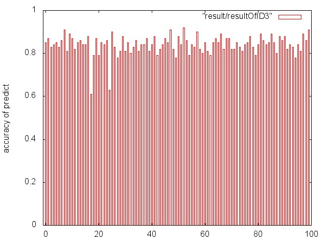
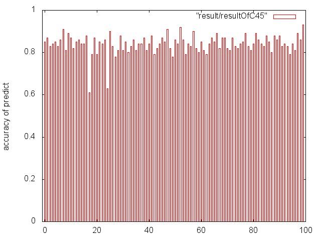

#决策树c++实现
##算法实现
>采用 ID3 和 C4.5 两种算法来实现决策树的生成，另外用使用的是李航的《统计学习方法》里面的决策树剪枝算法进行剪枝

##文件结构
	.
	├── README.MD
	├── data
	│   └── dataset.txt
	├── data description
	│   └── data description.txt
	├── result_histogram.plt
	├── run.sh
	├── src
	│   ├── calResult.cpp
	│   ├── decisionMakingTree.h
	│   ├── decisongMakingTreeMaker.cpp
	│   ├── entropy.h
	│   ├── informationGain.h
	│   ├── node.h
	│   ├── predict.h
	│   ├── predictByDecisionMakingTree.cpp
	│   ├── prepareBeforePredict.cpp
	│   ├── pruningOfTheTree.h
	│   └── table.h
	└── test
	    ├── tableTest.cpp
	    ├── testDecisionTreeMaker.cpp
	    ├── testEntropy.cpp
	    └── testInformationGain.cpp
        
 
##运行描述
直接运行脚本

	$bash run.sh

对测试的结果画了条形图，用到了 gunplot 工具，如果你没有安装这个工具，你可以去
[gunpot](http://www.gnuplot.vt.edu/) 这里下载一个进行安装。

##算法测试
 在上面的文件中，dataset.txt 是来自美国的选举数据，数据集的描述在文件 data description.txt 中。
 
 在我的测试里面，对训练数据集dataset.txt进行分割，在 dataset.txt 中随机选出100组数据作为预测数据，另外的335组数据作为训练数据集。
 
 一共进行了 100 组测试，测试方式是将100组测试数据的特征输入到决策树，将决策树的输出结果与正确的结果进行对比，计算正确率，测试的结果如下(输出的结果在result文件夹)：
 
 [ID3算法的测试结果](result/resultOfID3)
 
 [C4.5算法的测试结果](result/resultOfC45)
 
 根据这两个结果画出来的柱状图如下：
 
>ID3

 
 
>C4.5

 
 
 
###测试结果分析
从测试的结果看起来，在生成决策树的时候的阈值设置非常重要。另外，在这组数据里面其实 C4.5 的效果并没有比 ID3 好。两者的效果其实是相差不大的。

 
 
 	
 